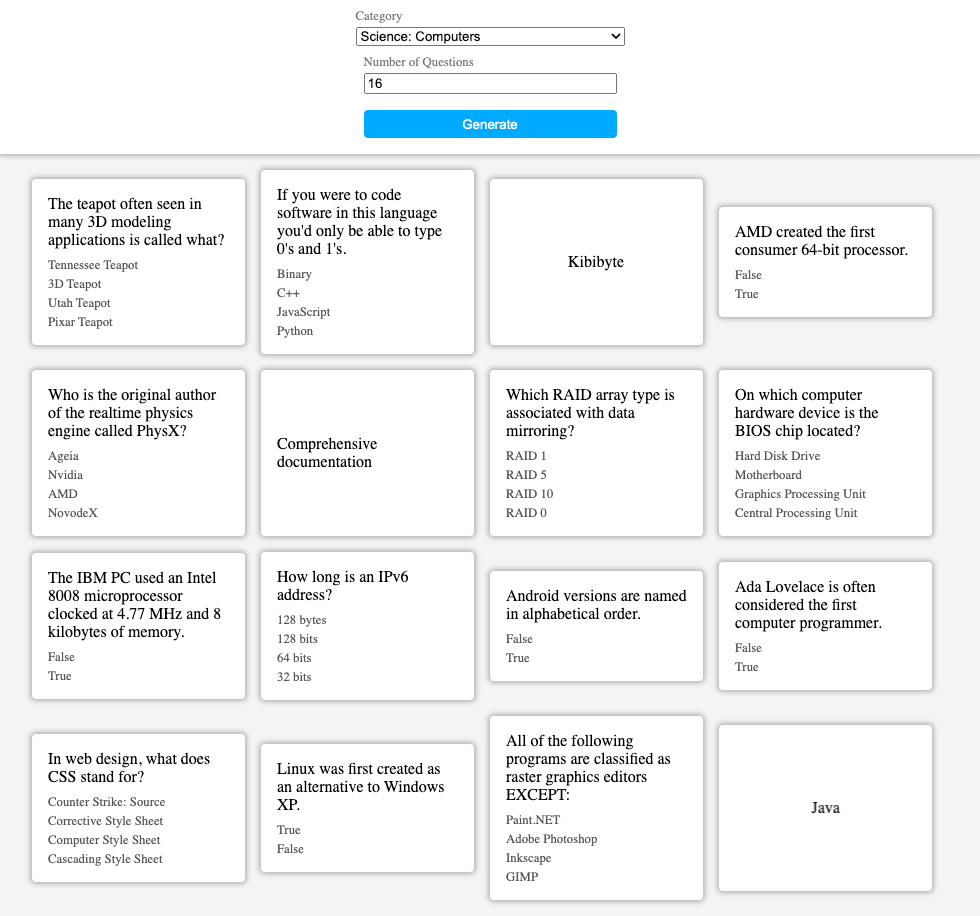
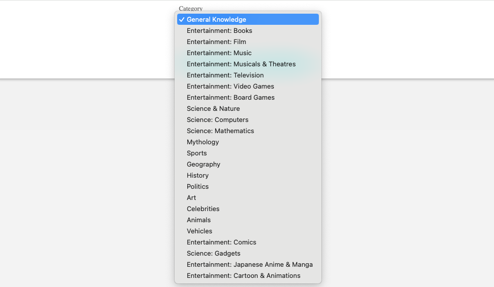

# Flashcard App

This is a simple React application that generates flashcards based on trivia questions fetched from the [Open Trivia Database API](https://opentdb.com/).

## Features

- Fetches trivia categories from the Open Trivia Database API.
- Allows users to select a category and specify the number of questions they want to generate.
- Fetches trivia questions from the API based on user selection.
- Decodes HTML entities in the questions and answers for display.
- Generates randomized options for each question.
- Displays flashcards with questions and multiple-choice options.
- Provides the correct answer upon selection.
- Styled using CSS.

## Usage

1. Select a trivia category from the dropdown menu.
2. Specify the number of questions you want to generate.
3. Click on the "Generate" button.
4. Flashcards with trivia questions will be displayed.
5. Select the correct answer from the options provided.

## Technologies Used

- React.js
- axios for API requests
- HTML/CSS

## Source

- This project uses the [Open Trivia Database API](https://opentdb.com/) to fetch trivia questions.
- Source: https://youtu.be/hEtZ040fsD8?si=k07Lj9WQCuDp0gQw
